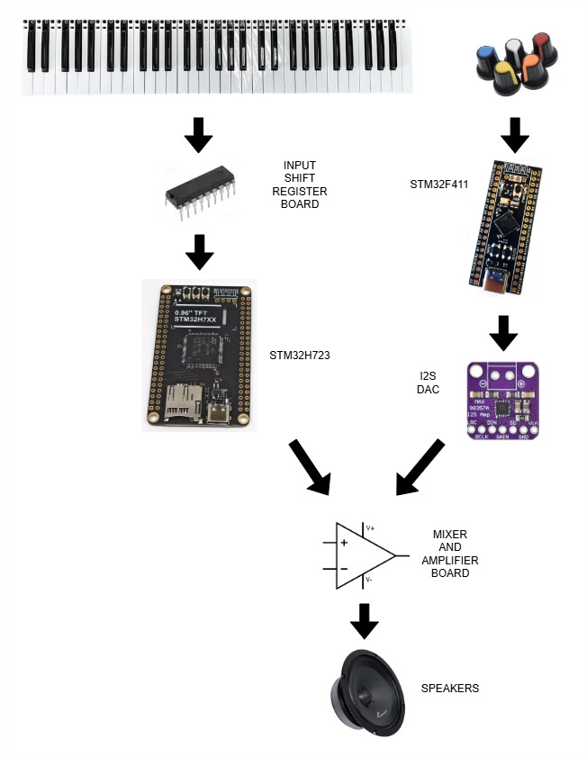
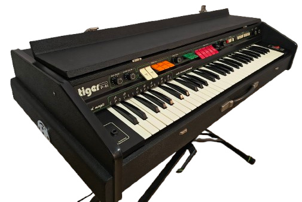

I made this in order to replace the electronics in a dead Eko Tiger P61.
- It uses waveforms of the original instruments and percussion, with additional leslie and chorus effect.
- STM32H723 for the organ sound engine
- STM32F411 handling percussion

You can listen to a demo here: https://youtu.be/llCsf_EyBWI?si=tI6ATRsklf8wZncn

